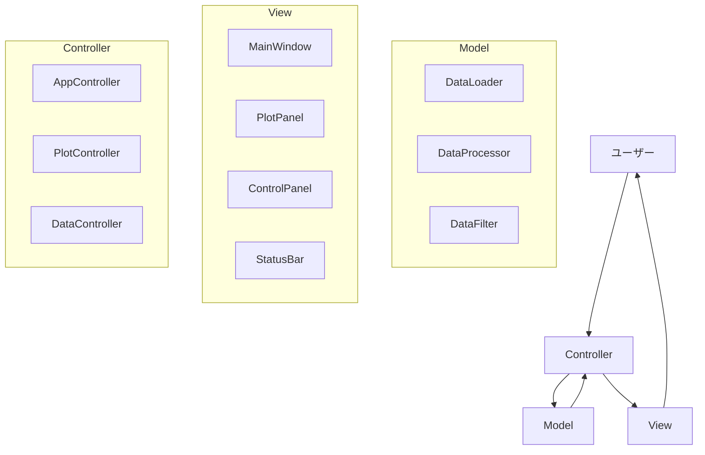
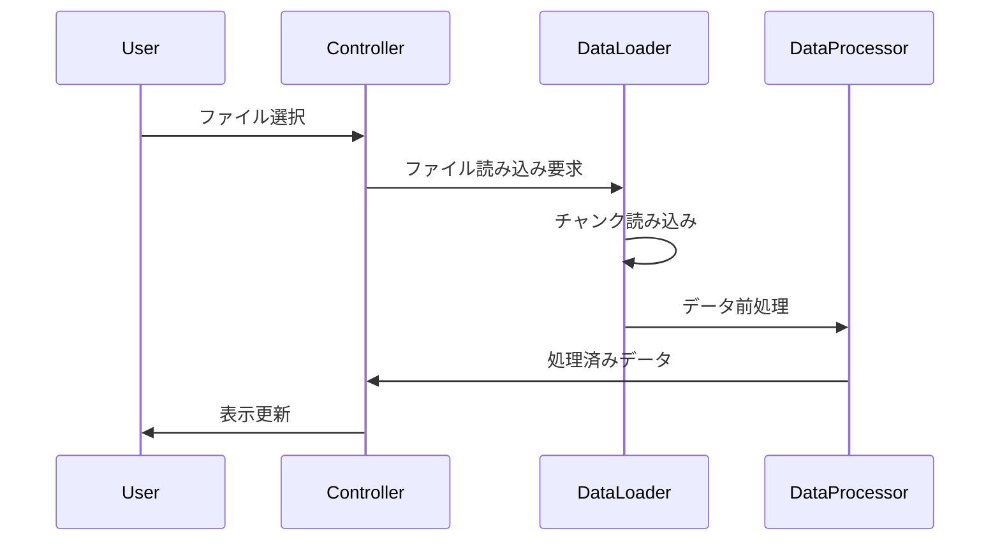
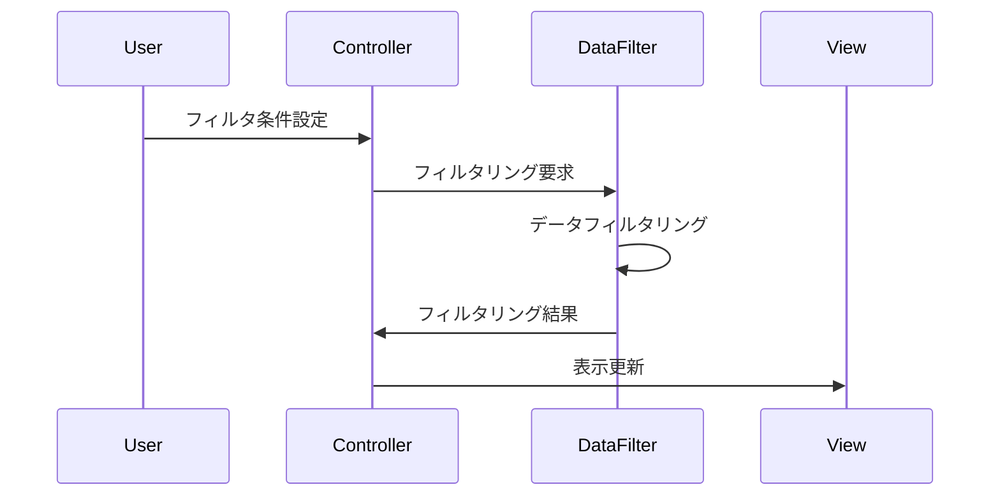

# カラープロットちゃん - システムパターン

## アーキテクチャパターン

### MVCパターン
プロジェクトはMVCパターンを採用し、以下のように構成されます：



## システム構造

### ディレクトリ構造
```
src/
├── main.py                  # アプリケーションのエントリーポイント
├── model/
│   ├── __init__.py
│   ├── data_loader.py       # データファイル読み込み
│   ├── data_processor.py    # データ処理
│   └── data_filter.py       # データフィルタリング
├── view/
│   ├── __init__.py
│   ├── main_window.py       # メインウィンドウUI
│   ├── plot_panel.py        # プロット表示
│   ├── control_panel.py     # コントロール
│   └── status_bar.py        # ステータス表示
└── controller/
    ├── __init__.py
    ├── app_controller.py    # アプリケーション制御
    ├── plot_controller.py   # プロット操作制御
    └── data_controller.py   # データ操作制御
```

## 技術的決定

### 1. フレームワークとライブラリ
- **UI**: tkinter
  - Pythonの標準ライブラリ
  - クロスプラットフォーム対応
  - 軽量で高速

- **グラフ描画**: matplotlib
  - 豊富な描画機能
  - tkinterとの統合が容易
  - カスタマイズ性が高い

- **データ処理**: numpy
  - 高速な数値計算
  - メモリ効率の良いデータ構造
  - 多次元配列の操作が容易

### 2. データ処理パターン

#### データローディング


#### データフィルタリング


### 3. イベント処理パターン

#### ユーザー操作の処理
- イベントドリブン方式
- コマンドパターンの採用
- 非同期処理の活用

#### 表示更新の最適化
- 必要な部分のみ再描画
- ダブルバッファリングの使用
- 更新頻度の制御

## デザインパターン

### 1. Observerパターン
- データモデルの変更通知
- ビューの自動更新
- コンポーネント間の疎結合維持

### 2. Strategyパターン
- データ読み込み戦略の切り替え
- フィルタリング方法の切り替え
- 表示方法の切り替え

### 3. Factoryパターン
- データローダーの生成
- ビューコンポーネントの生成
- コントローラーの生成

## エラー処理パターン

### 1. 例外処理
- カスタム例外クラスの定義
- 階層的な例外処理
- エラーログの記録

### 2. エラー表示
- ユーザーフレンドリーなエラーメッセージ
- エラー状態の視覚的表示
- リカバリー方法の提示

## パフォーマンス最適化パターン

### 1. データ管理
- メモリ使用量の最適化
- キャッシュの活用
- 遅延読み込み

### 2. 描画最適化
- 表示領域に応じたデータの間引き
- 描画更新の最適化
- ハードウェアアクセラレーションの活用

### 3. 応答性の確保
- 長時間処理の非同期実行
- プログレス表示
- キャンセル機能の提供
